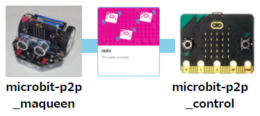

# maqueen_p2p

micro:bitを操作コントローラーとして使い、maqueen+micro:bitを操作するプログラムです。

- micro:bit本体の前後の傾きが、アクセル（モーターのスピード）になります。
- アクセルは、前進3段階、後進1段階で5x5 LEDにレベル表示します。
- micro:bitのAボタンで左モーターを、Bボタンで右モーターをオン/オフします。

## microbit-p2p_maqueen

[microbit-p2p_maqueen.hex](microbit-p2p_maqueen.hex) (micro:bit V1向け)

V2向けhexは、～_main.ts、～_pxt.json、～_custom.tsを参考にして作ってください。

～_custom.tsは、makecodeの拡張機能として DFROBOT社 から公開されている pxt-maqueen v1.5.4 の中にある maqueen.ts を流用し、不要な部分(IR関連など)をコメントアウトしたものです。

https://github.com/DFRobot/pxt-maqueen

## microbit-p2p_control

[microbit-p2p_control.hex](microbit-p2p_control.hex) (micro:bit V2向け)

V1向けhexは、～_main.ts、～_pxt.jsonを参考にして作ってください。

## おまけ

microbit-rotate.hexは、micro:bitの傾きを調べるプログラム(micro:bit V2向け)です。

rotate.htmlをchromeなどで開き、測定ボタンをクリックしてmicro:bitにBluetoothで接続するとmicro:bitの傾きが分かります。
